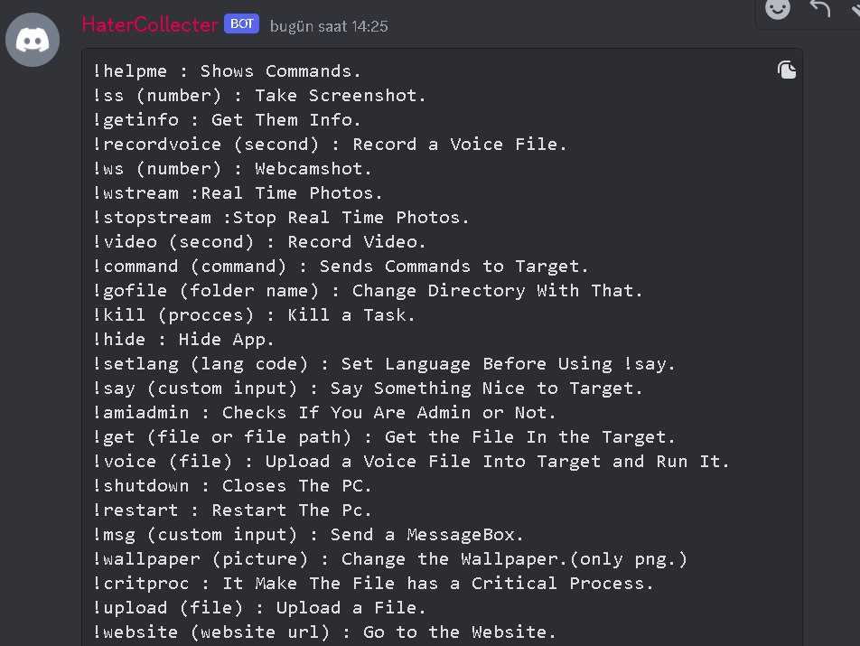
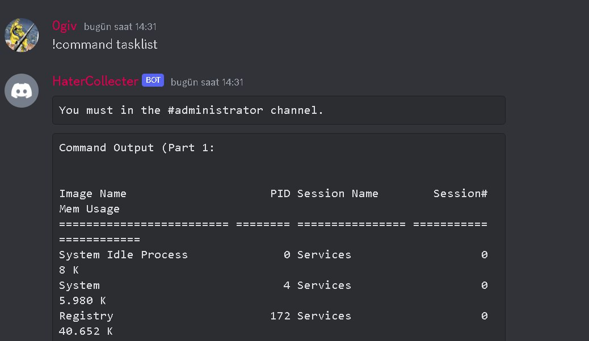
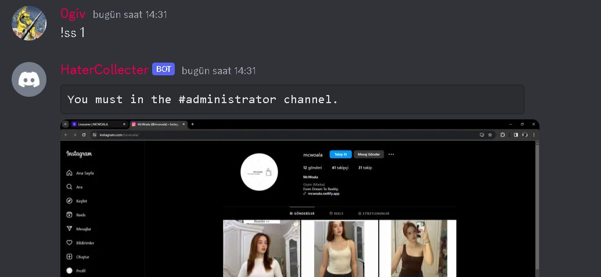
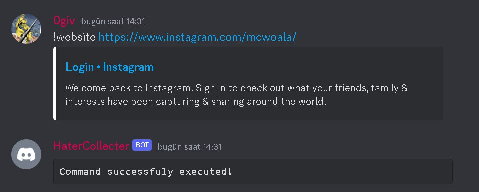

**Requirements:**\
Python3, Windows(x64)


## **Setup Guide:**
You will first need to register a bot with the Discord developer portal and then add the bot to the Discord server that you want to use to control the bot (make sure the bot has administrator privileges in the Discord server).
Once the bot is created copy the token of your bot and paste it at line 33.
<li>Add the relevant tokens to the HaterCollecter.py file under the "token =" fields.


Install requirements :
```
pip3 install -r requirements.txt
```
Then if the steps above were successful, you can launch the python file by executing ```python HaterCollecter.py```. It will create a new channel and post a message on the server with a generated session number.\
Now your bot should be available to use ! 

If you want an exe file you need to install  ```pyinstaller```

## **PyInstaller Guide:**
 After downloading PyInstaller
 ```
pyinstaller filename --one-file --window
 ```


## **Usage**
<li>
 After getting the victim, send !helpme command in the opened channel</li>
 
## **Command List**
```
!helpme: Displays commands.
!ss (number): Takes a screenshot. Specify the number of screenshots to be taken as a parameter.
!getinfo: Retrieves information about the target system.<br><li>
!recordvoice (second): Records voice for a specified duration.<br><li>
!ws (number): Takes photos from the webcam. Specify the number of photos to be taken as a parameter.
!wstream: Captures real-time photos.
!stopstream: Stops capturing real-time photos.
!video (second): Records video for a specified duration.
!command (command): Executes a command on the target system.
!gofile (folder name): Changes directory to the specified folder.
!kill (process): Terminates a specified task.
!hide: Hides the application.
!setlang (lang code): Sets the language before using !say.
!say (custom input): Says something to the target.
!amiadmin: Checks if you are an admin or not.
!get (file or file path): Gets the file from the target.
!voice (file): Uploads a voice file into the target and runs it.
!shutdown: Shuts down the PC.
!restart: Restarts the PC.
!msg (custom input): Sends a MessageBox.
!wallpaper (picture): Changes the wallpaper (only supports png format).
!critproc: Makes the file a critical process.
!upload (file): Uploads a file.
!website (website url): Goes to the website.
!cmd: Displays the best CMD commands (also available on the internet).
!session : Create a session for your victim. (Needs a restart to use.)
!passwrd : Get Passwords & Accounts Cookies & Logins & Cards & Web History & Downloads & Info.
```
## **To Do:**
```
Make a builder for Rat.
Make a Gui for builder.
Make it more durable/permanent.
```
## **Contact**
<li>Discord : 0giv

## **Example Photos:**
<br>
<br>
<br>
<br>


## **Disclaimer:**

This tool is for educational use only, the author will not be held responsible for any misuse of this tool.
